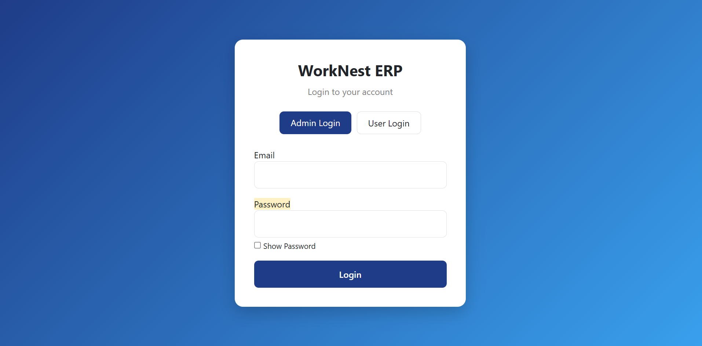
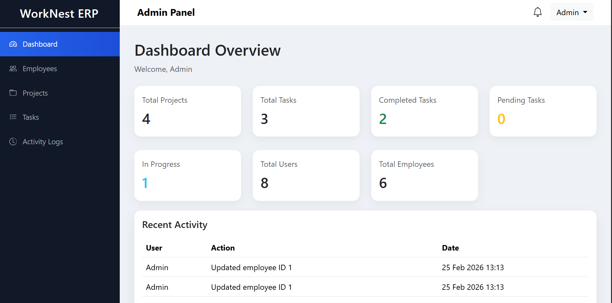
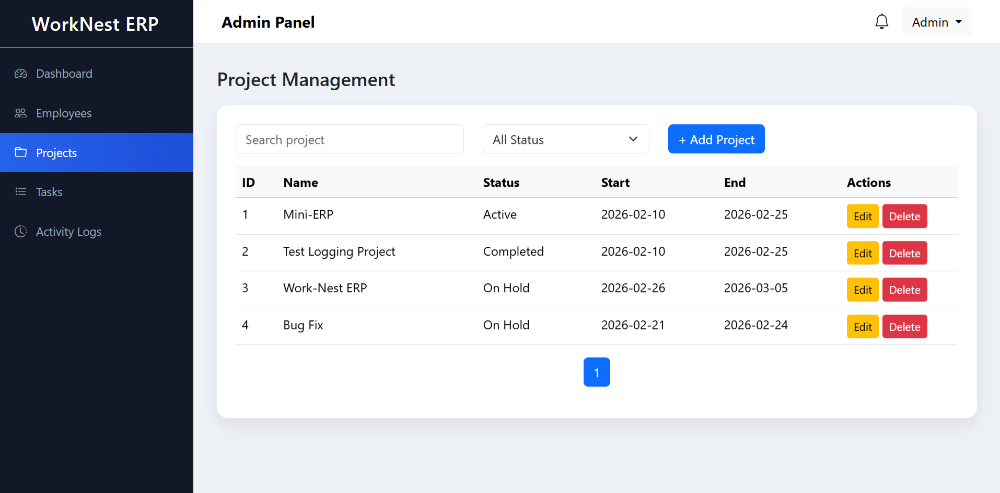
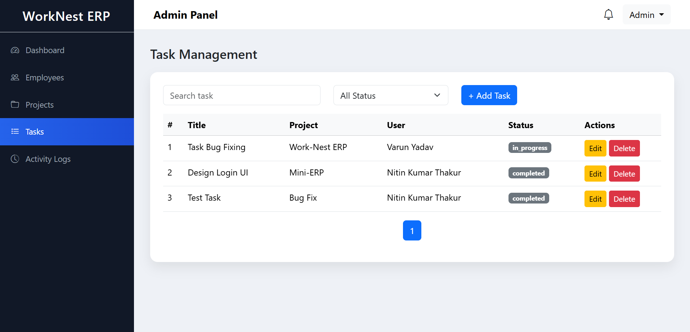
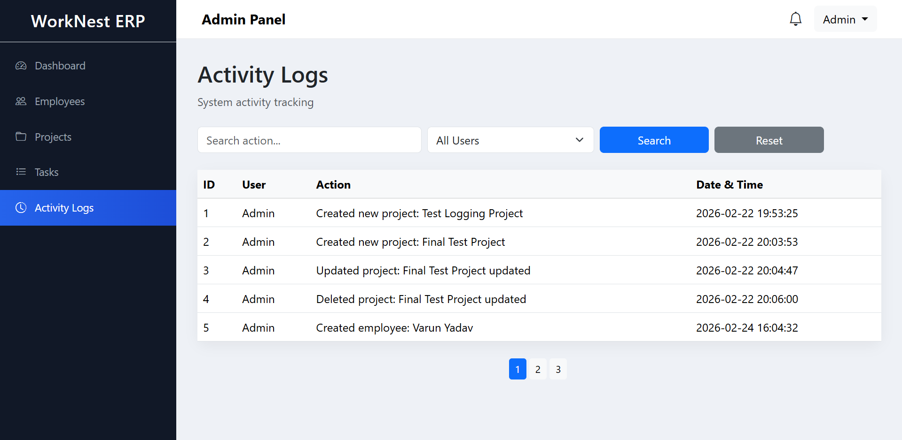
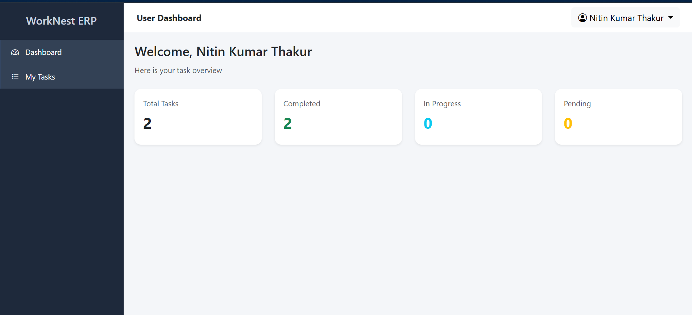
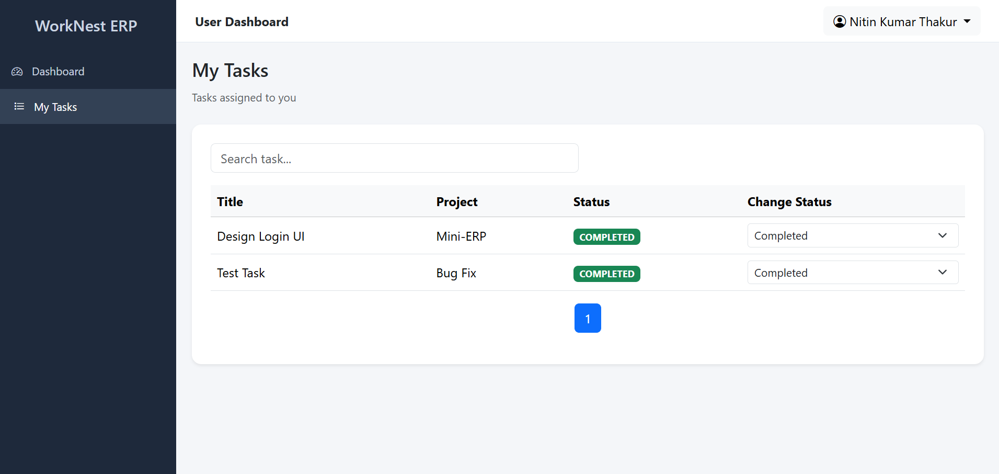

# WorkNest ERP

WorkNest ERP is a mini Enterprise Resource Planning (ERP) system developed using Core PHP and MySQL on the LAMPP/XAMPP platform.

The system provides Employee Management, Project Management and Task Assignment with role-based authentication.

Admins can manage employees, projects and tasks, while users can view and update their assigned tasks.

This project was developed as part of a Technical Assignment using the LAMPP Platform.

---

## Tech Stack

### Backend
- PHP 8.x (Core PHP)
- REST API Architecture
- Session Authentication

### Frontend
- HTML5
- CSS3
- Bootstrap 5
- JavaScript (Fetch API)

### Database
- MySQL 

### Server
- Apache (XAMPP)

---

## Features Implemented

### Authentication System

- Secure Login System
- Password Hashing
- Session Management
- Session Timeout Protection
- Logout System

---

### Role Based Access

#### Admin Panel

Admin can:

- Manage Employees
- Manage Projects
- Manage Tasks
- Assign Tasks to Users
- Edit Tasks
- Delete Tasks
- View Activity Logs

---

#### User Panel

User can:

- Login securely
- View assigned tasks
- Update task status
- Track project tasks

Task Status Options:

- Pending
- In Progress
- Completed

---

### Employee Management

Admin can:

- Add Employee
- Edit Employee
- Delete Employee
- View Employee List

---

### Project Management

Admin can:

- Create Project
- Edit Project
- Delete Project
- View Projects

---

### Task Management

Admin can:

- Create Tasks
- Assign Tasks to Users
- Edit Tasks
- Delete Tasks
- Set Due Dates

Users can:

- View Assigned Tasks
- Change Task Status

---

### REST API Integration

Fully functional REST APIs implemented.

Modules connected using REST APIs:

- Employees API
- Projects API
- Tasks API
- Users API
- Activity Logs API

Supported Methods:

- GET
- POST
- PUT
- DELETE

---

## Setup Instructions

### Step 1 — Install XAMPP

Download XAMPP:

https://www.apachefriends.org/

Start:

- Apache
- MySQL

---

### Step 2 — Clone Repository

git clone https://github.com/nkt18/worknest-erp.git

OR Download ZIP.

---

### Step 3 — Move Project

Place project inside:

C:\xampp\htdocs\

Final path:

C:\xampp\htdocs\worknest-erp

---

### Step 4 — Create Database

Open:

http://localhost/phpmyadmin

Create database:

worknest_db

---

### Step 5 — Import Database

Open database.

Click:

Import

Upload:

database/schema.sql

Click:

Go

---

### Step 6 — Environment Configuration

Create file:

.env

Copy content from:

.env.example

Example configuration:

DB_HOST=localhost
DB_NAME=worknest_db
DB_USER=root
DB_PASS=

BASE_URL=http://localhost/worknest-erp

---

### Step 7 — Run Project

Open browser:

http://localhost/worknest-erp/src/auth/login.php

---

## Test Credentials

### Admin Login

Email:

admin@worknest.com

Password:

admin@073

---

### User Login

Email:

nitint8350@gmail.com

User Default Password:

12345678

---

## API Endpoints

### Employees API

GET    /src/api/employees.php
POST   /src/api/employees.php
PUT    /src/api/employees.php?id=ID
DELETE /src/api/employees.php?id=ID

---

### Projects API

GET    /src/api/projects.php
POST   /src/api/projects.php
PUT    /src/api/projects.php?id=ID
DELETE /src/api/projects.php?id=ID

---

### Tasks API

GET    /src/api/tasks.php
POST   /src/api/tasks.php
PUT    /src/api/tasks.php?id=ID
DELETE /src/api/tasks.php?id=ID

---

### Users API

GET /src/api/users.php

---

### Activity Logs API

GET /src/api/activity_logs.php

---

## Project Structure

worknest-erp
│
├── database
│   └── schema.sql
│
├── src
│   ├── admin
│   ├── user
│   ├── api
│   ├── auth
│   ├── config
│   ├── middleware
│   └── layout
│
├── .env.example
├── .gitignore
└── README.md

---

## Deployment Free Hosting

Project deployed on InfinityFree:

https://worknest-erp.gt.tc

Login Page:

https://worknest-erp.gt.tc/src/auth/login.php

---

## Known Limitations

- No Email Notifications
- No File Upload System
- No Dashboard Analytics
- No Advanced Reports

---

## Screenshots

### Login Page

### Admin Dashboard

### Employee Management

### Project Management

### Task Mangement 

### Activity Logs

### User Dashboard

### User Task 

