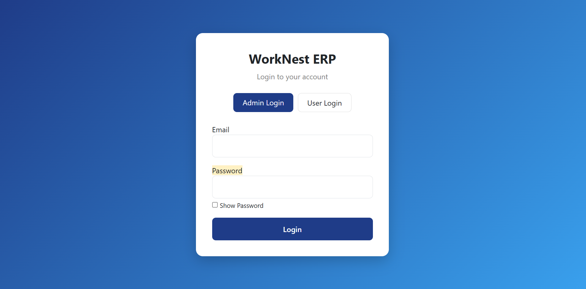
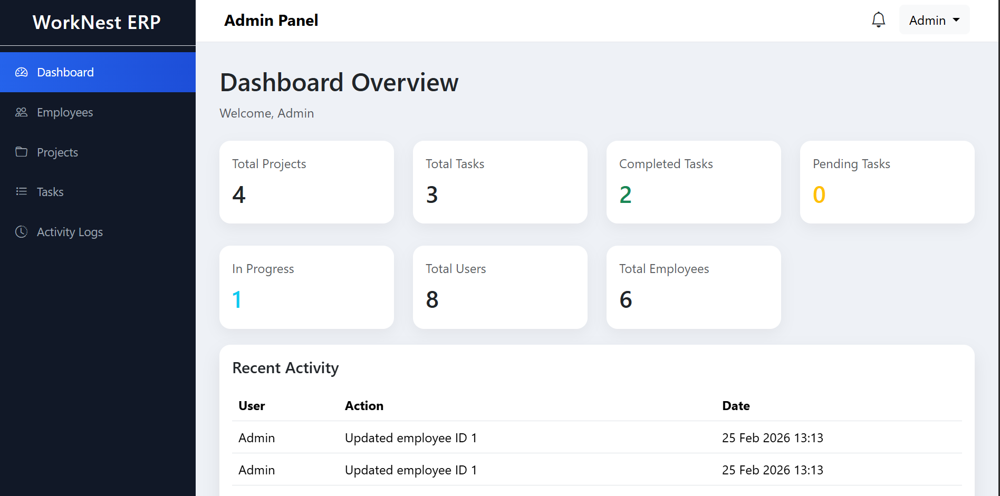
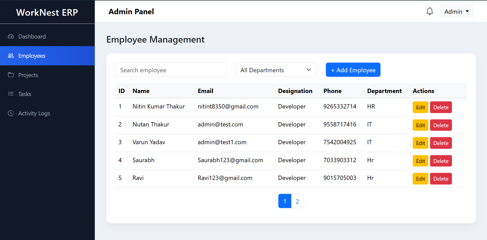
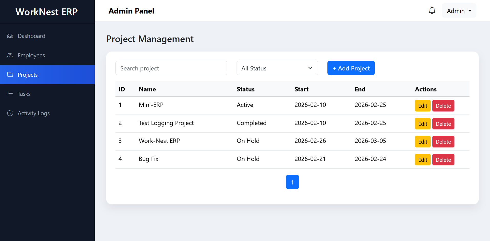
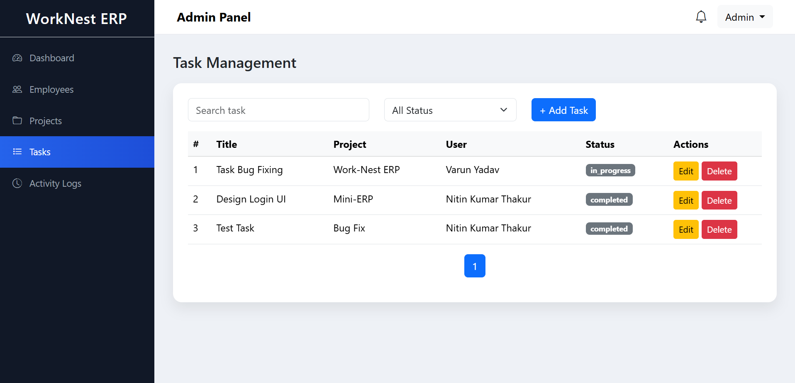
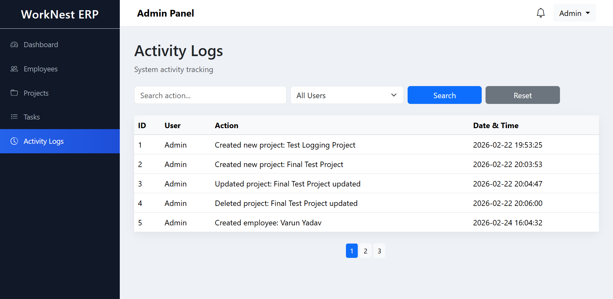
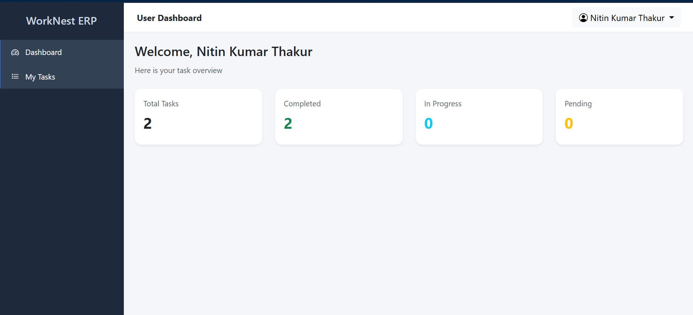
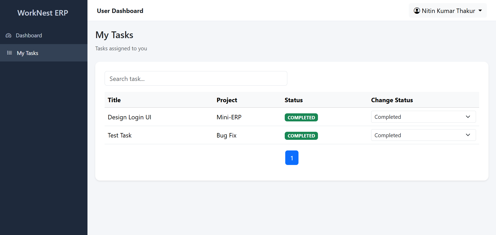

# WorkNest ERP

WorkNest ERP is a mini ERP application built with Core PHP, MySQL, Bootstrap, and Apache on XAMPP/LAMPP. It supports employee management, project management, task assignment, role-based access control, and activity logging through a small service-driven architecture.

The current codebase includes:

- admin and user dashboards
- REST-style API endpoints
- centralized middleware for authentication and authorization
- service-layer business logic for projects, tasks, employees, and activity logs
- CSRF protection, session hardening, and login rate limiting
- documentation for the database schema, request flow, and code/security improvements

## Tech Stack

- PHP 8.x
- MySQL
- Apache (XAMPP/LAMPP)
- Bootstrap 5
- JavaScript Fetch API

## Core Features

- Secure login and logout
- Role-based access for `admin` and `user`
- Employee CRUD management
- Project CRUD management
- Task creation, assignment, update, delete, and user status updates
- Activity log viewing for admin users
- Session timeout and secure session handling
- CSRF protection for authenticated write requests
- Prepared statements for input-driven database operations

## Architecture Overview

The project now follows a more structured layered design while staying in Core PHP.

- `src/api/`
  Thin JSON request handlers
- `src/admin/modules/`
  Browser-based admin module handlers and views
- `src/auth/`
  Login and logout flows
- `src/helpers/`
  Shared utilities for session handling, CSRF, validation, API responses, rate limiting, logging, and DB access
- `src/middleware/`
  Shared auth and role enforcement
- `src/services/`
  Centralized business logic for employees, projects, tasks, and activity logs

## Security and Code Improvements

The current implementation includes the following improvements:

- duplicated CRUD logic reduced by moving domain logic into services
- authorization centralized through middleware and `requireRole()`
- activity logging standardized through `src/helpers/logger.php`
- validation and response normalization centralized in `src/helpers/entities.php`
- session security hardened through `src/helpers/session.php`
- CSRF protection enforced for state-changing authenticated requests
- login flow hardened with rate limiting and secure session initialization
- linked employee and user operations wrapped in transactions

Detailed write-up:

- [docs/code-improvements-and-security-gaps.md](/Applications/XAMPP/xamppfiles/htdocs/worknest-erp/docs/code-improvements-and-security-gaps.md)

## Documentation

- [docs/db-schema-diagram.md](/Applications/XAMPP/xamppfiles/htdocs/worknest-erp/docs/db-schema-diagram.md)
- [docs/request-flow-diagram.md](/Applications/XAMPP/xamppfiles/htdocs/worknest-erp/docs/request-flow-diagram.md)
- [docs/code-improvements-and-security-gaps.md](/Applications/XAMPP/xamppfiles/htdocs/worknest-erp/docs/code-improvements-and-security-gaps.md)

## Database Schema

Main tables:

- `users`
- `employees`
- `projects`
- `tasks`
- `activity_logs`

Important relationships:

- `employees.user_id -> users.id`
- `projects.created_by -> users.id`
- `tasks.project_id -> projects.id`
- `tasks.assigned_to -> users.id`
- `activity_logs.user_id -> users.id`

The full schema is defined in:

- [database/schema.sql](/Applications/XAMPP/xamppfiles/htdocs/worknest-erp/database/schema.sql)

## Local Setup

### 1. Install and Start XAMPP

Install XAMPP and start:

- Apache
- MySQL

### 2. Clone the Repository

```bash
git clone https://github.com/nkt18/worknest-erp.git
```

Place the project in:

```text
/Applications/XAMPP/xamppfiles/htdocs/worknest-erp
```

### 3. Create the Database

Open phpMyAdmin and create a database named:

```text
worknest_erp
```

### 4. Import the Schema

Import:

```text
database/schema.sql
```

### 5. Configure Environment Variables

Create a `.env` file from `.env.example`.

Example:

```ini
DB_HOST=localhost
DB_NAME=worknest_erp
DB_USER=root
DB_PASS=

BASE_URL=http://worknest.local
APP_NAME=WorkNest ERP
```

## Virtual Host Setup

The current app is configured to run through a virtual host and front controller routing.

### 1. Add Hosts Entry

Add this line to `/etc/hosts`:

```text
127.0.0.1 worknest.local
```

### 2. Add Apache Virtual Host

In XAMPP Apache vhosts config:

```text
/Applications/XAMPP/xamppfiles/etc/extra/httpd-vhosts.conf
```

add:

```apache
<VirtualHost *:80>
    ServerName worknest.local
    DocumentRoot "/Applications/XAMPP/xamppfiles/htdocs/worknest-erp"

    <Directory "/Applications/XAMPP/xamppfiles/htdocs/worknest-erp">
        Options Indexes FollowSymLinks Includes ExecCGI
        AllowOverride All
        Require all granted
    </Directory>

    ErrorLog "logs/worknest.local-error_log"
    CustomLog "logs/worknest.local-access_log" common
</VirtualHost>
```

### 3. Verify Apache Main Config

In:

```text
/Applications/XAMPP/xamppfiles/etc/httpd.conf
```

make sure these are enabled:

```apache
Listen 80
ServerName localhost:80
LoadModule rewrite_module modules/mod_rewrite.so
Include etc/extra/httpd-vhosts.conf
```

Also make sure this line is not active:

```apache
#Include "/Applications/XAMPP/xamppfiles/apache2/conf/httpd.conf"
```

### 4. Restart Apache

After editing Apache config:

- stop Apache
- start Apache again

### 5. Open the Application

Use:

- `http://worknest.local/`
- `http://worknest.local/login`

## Routing Notes

The application now uses:

- [index.php](/Applications/XAMPP/xamppfiles/htdocs/worknest-erp/index.php) as a front controller
- [/.htaccess](/Applications/XAMPP/xamppfiles/htdocs/worknest-erp/.htaccess) for rewrite-based route forwarding
- `appRoute()` in `src/helpers/app.php` for route generation

This allows clean URLs such as:

- `/login`
- `/logout`
- `/admin/dashboard`
- `/admin/tasks`
- `/user/dashboard`
- `/api/tasks`

## Main Request Flow

High-level flow:

1. request enters `index.php` or a direct route
2. middleware validates session and role where needed
3. helpers parse request data and enforce CSRF
4. service layer performs business logic
5. database operations run through mysqli
6. state-changing actions are logged
7. HTML or JSON response is returned

Detailed diagram:

- [docs/request-flow-diagram.md](/Applications/XAMPP/xamppfiles/htdocs/worknest-erp/docs/request-flow-diagram.md)

## Authentication and Security

Current controls include:

- password hashing
- secure cookie-based sessions
- session ID rotation
- idle timeout enforcement
- session fingerprint verification
- logout invalidation
- CSRF token validation
- login rate limiting by identity and IP
- unified invalid credential messaging

Relevant files:

- [src/auth/login.php](/Applications/XAMPP/xamppfiles/htdocs/worknest-erp/src/auth/login.php)
- [src/helpers/session.php](/Applications/XAMPP/xamppfiles/htdocs/worknest-erp/src/helpers/session.php)
- [src/helpers/csrf.php](/Applications/XAMPP/xamppfiles/htdocs/worknest-erp/src/helpers/csrf.php)
- [src/helpers/rate_limit.php](/Applications/XAMPP/xamppfiles/htdocs/worknest-erp/src/helpers/rate_limit.php)
- [src/middleware/auth.php](/Applications/XAMPP/xamppfiles/htdocs/worknest-erp/src/middleware/auth.php)

## API Endpoints

Current routed API paths:

- `GET    /api/employees`
- `POST   /api/employees`
- `PUT    /api/employees?id=ID`
- `DELETE /api/employees?id=ID`
- `GET    /api/projects`
- `POST   /api/projects`
- `PUT    /api/projects?id=ID`
- `DELETE /api/projects?id=ID`
- `GET    /api/tasks`
- `POST   /api/tasks`
- `PUT    /api/tasks?id=ID`
- `DELETE /api/tasks?id=ID`
- `GET    /api/users`
- `GET    /api/activity-logs`

Underlying handlers:

- [src/api/employees.php](/Applications/XAMPP/xamppfiles/htdocs/worknest-erp/src/api/employees.php)
- [src/api/projects.php](/Applications/XAMPP/xamppfiles/htdocs/worknest-erp/src/api/projects.php)
- [src/api/tasks.php](/Applications/XAMPP/xamppfiles/htdocs/worknest-erp/src/api/tasks.php)
- [src/api/users.php](/Applications/XAMPP/xamppfiles/htdocs/worknest-erp/src/api/users.php)
- [src/api/activity_logs.php](/Applications/XAMPP/xamppfiles/htdocs/worknest-erp/src/api/activity_logs.php)

## Sample Credentials

Admin:

- Email: `admin@worknest.com`
- Password: `admin@073`

User:

- Email: `nitint8350@gmail.com`
- Password: `12345678`

## Project Structure

```text
worknest-erp
├── database/
│   └── schema.sql
├── docs/
│   ├── code-improvements-and-security-gaps.md
│   ├── db-schema-diagram.md
│   └── request-flow-diagram.md
├── src/
│   ├── admin/
│   ├── api/
│   ├── auth/
│   ├── config/
│   ├── helpers/
│   ├── layout/
│   ├── middleware/
│   ├── services/
│   └── user/
├── .env.example
├── .htaccess
├── index.php
└── README.md
```

## Known Limitations

- no email notifications
- no file upload module
- no advanced reports
- no dashboard analytics module

## Screenshots

Login page:



Admin dashboard:



Employee management:



Project management:



Task management:



Activity logs:



User dashboard:



User task view:


