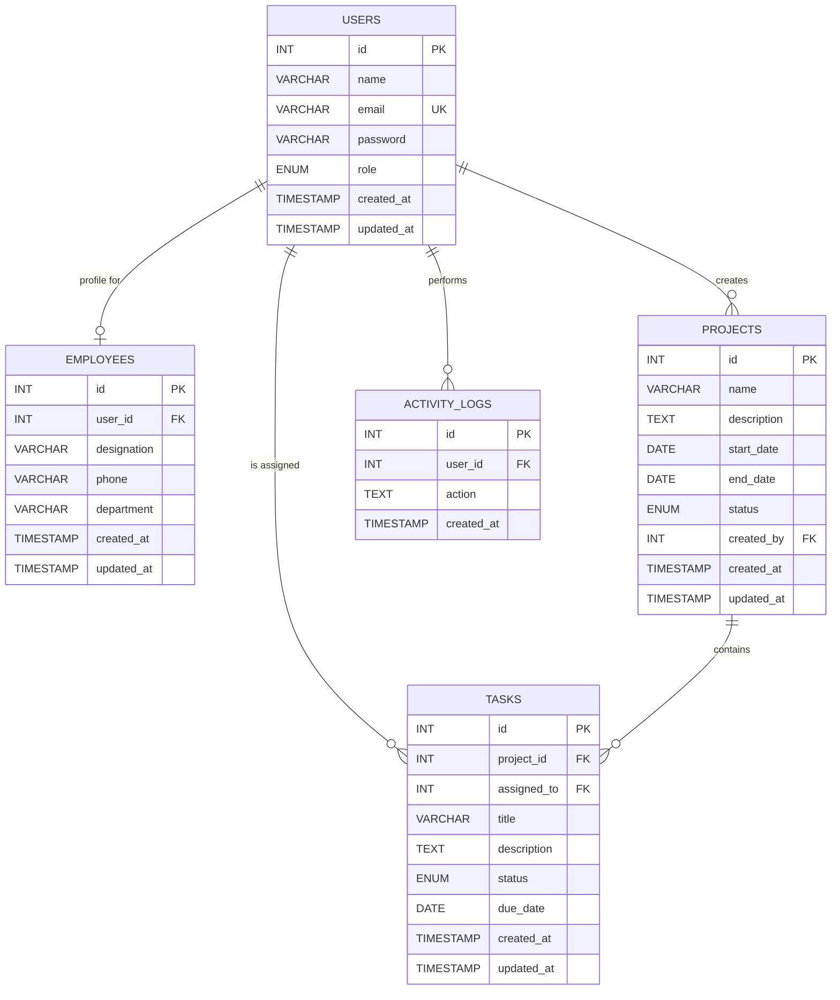

# Database Schema Diagram

This diagram reflects the current schema defined in `database/schema.sql`.

## Relationship Notes

- `employees.user_id -> users.id` with `ON DELETE CASCADE`
- `projects.created_by -> users.id` with `ON DELETE SET NULL`
- `tasks.project_id -> projects.id` with `ON DELETE CASCADE`
- `tasks.assigned_to -> users.id` with `ON DELETE SET NULL`
- `activity_logs.user_id -> users.id` with `ON DELETE SET NULL`

## Behavioral Notes From The Code

- Employee creation is a two-step transaction: insert into `users`, then insert into `employees`.
- Employee deletion removes both the `employees` row and its linked `users` row.
- Project and task writes are performed through service-layer functions in `src/services/`.
- State-changing API calls usually also append a row to `activity_logs`.
