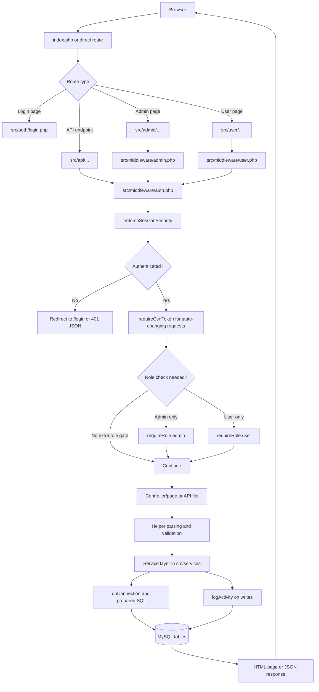
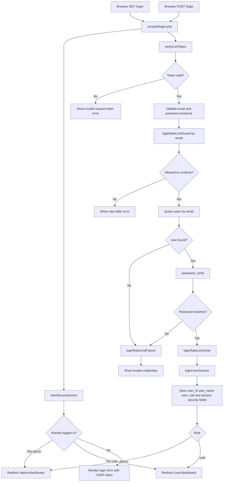
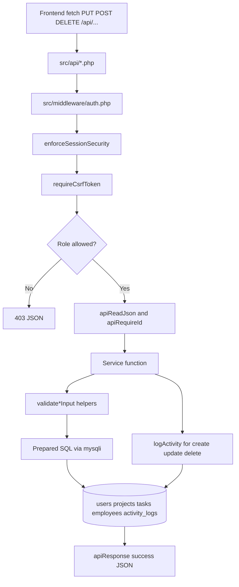

# Request Flow Diagram

These diagrams reflect the current PHP request flow used by the app.

## High-Level Application Flow

## Login Request Flow

## API Write Flow

## Concrete Paths Covered

- Login and session bootstrap: `src/auth/login.php`, `src/helpers/session.php`
- Shared auth gate: `src/middleware/auth.php`
- Role wrappers: `src/middleware/admin.php`, `src/middleware/user.php`
- APIs: `src/api/projects.php`, `src/api/tasks.php`, `src/api/employees.php`, `src/api/activity_logs.php`, `src/api/users.php`
- Services: `src/services/ProjectService.php`, `src/services/TaskService.php`, `src/services/EmployeeService.php`, `src/services/ActivityLogService.php`
- Database access: `src/helpers/database.php`, `src/config/database.php`
